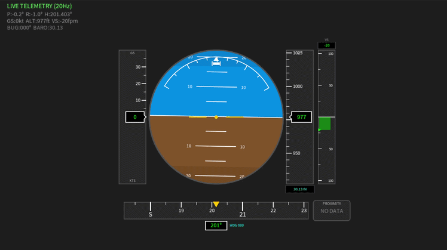

# Real-Time Flight Instrumentation Platform (AHRS + PFD)

An ESP32-S3 sensor unit, built on a custom KiCad-designed PCB, estimates aircraft
attitude, heading, altitude and vertical speed in real time and streams them over a
2.4 GHz RF link to a Primary Flight Display (PFD) that renders a Basic-T instrument
layout with a moving map.

Bachelor's thesis (TFG), Aerospace Vehicle Engineering, UPC - ESEIAAT.



## Key results

- End-to-end latency (sensor to display) under 200 ms
- Display refresh rate above 60 FPS
- Total hardware cost under 100 EUR (custom PCB plus off-the-shelf sensors)
- Fully open-source: custom hardware and firmware

## Overview

The platform reproduces the core instruments of a glass cockpit on low-cost, custom
hardware. It has two parts communicating over a 2.4 GHz RF link:

- **Sensor unit (ESP32-S3, custom PCB):** reads the IMU and barometric sensor, runs a
  Mahony filter to estimate attitude (pitch and roll) and heading, derives altitude and
  vertical speed from atmospheric pressure, and transmits the state over the RF link.
- **Primary Flight Display (Processing):** receives the telemetry and renders a Basic-T
  layout together with a moving map in real time (attitude indicator, airspeed and altitude
  tapes, heading, map), following aeronautical display references (ARINC 429). The display
  can also be bridged to an Android device.

## Repository structure

```
Software/      ESP32-S3 firmware (C/C++), the PFD (Processing) and Python tooling
PCB/           custom PCB, designed in KiCad (schematic and layout)
LATEX/         thesis document (memoria) source
Presentacio/   defense presentation
Entrega/       final submission package
```

## Hardware

| Component         | Part                        |
|-------------------|-----------------------------|
| MCU               | ESP32-S3                    |
| PCB               | Custom, designed in KiCad   |
| IMU               | MPU-9250 (9-DOF)            |
| Barometric sensor | BMP280                      |
| RF transceiver    | NRF24L01+ (2.4 GHz)         |

Total bill of materials: under 100 EUR.

## Software and tech stack

- **Firmware:** C/C++ on the ESP32-S3 (I2C/SPI for the sensors, SPI for the RF module)
- **PFD:** Processing (Basic-T instruments and moving map)
- **Python tooling:** downloads the map tiles used by the PFD map, and bridges the
  connection to an Android device

## How it works

Attitude and heading are obtained by fusing the MPU-9250 accelerometer, gyroscope and
magnetometer with a Mahony filter. Altitude and vertical speed are derived from BMP280
barometric pressure. The sensor unit packs the state into a fixed-size telemetry packet
sent over the NRF24L01+ link, and the Processing PFD updates its render loop on each
packet, redrawing the Basic-T instruments and the moving map. Map tiles are fetched with
a Python script, and a second Python script handles the bridge to Android. Layout and
behavior reference ARINC 429 and standard PFD conventions.

## Build and run

```bash
git clone https://github.com/arnaumora/TFG-Plataforma-Instrumentacion-Avionica.git
```

- **Firmware (sensor unit):** open the ESP32-S3 firmware in `Software/` and flash it to the board.
- **PFD:** open the Processing sketch in `Software/` and run it (connect the RF receiver first).
- **Map tiles / Android:** run the Python scripts in `Software/` as needed.


## References

- ARINC 429
- [any papers or references on AHRS / sensor fusion you used]

## License

Released under the MIT License. See [LICENSE](LICENSE).

## Author

**Arnau Mora Pérez** - Aerospace Vehicle Engineering, UPC - ESEIAAT
[linkedin.com/in/arnau-mora](https://www.linkedin.com/in/arnau-mora)
# TFG-Plataforma-Instrumentacion-Avionica
# TFG-Plataforma-Instrumentacion-Avionica
